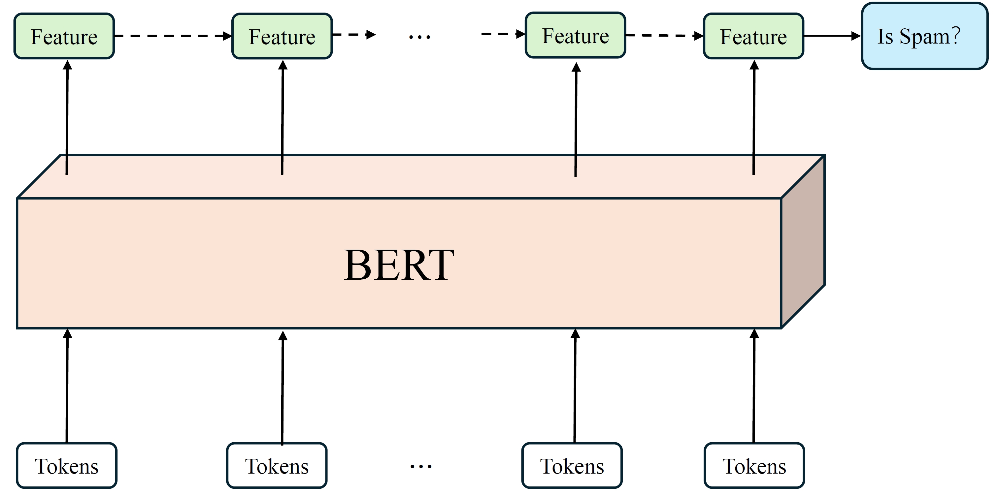

# SMS Spam Detection with BERT and BiLSTM

This repository contains the code for SMS spam detection using a combination of BERT (Bidirectional Encoder Representations from Transformers) and BiLSTM (Bidirectional Long Short-Term Memory) models. The model is trained and evaluated on the SMS Spam Collection Dataset.

## Overview

SMS spam detection is an important task in the field of natural language processing and information security. This project aims to effectively detect spam messages using a combination of pre-trained BERT model and BiLSTM network. The BERT model is fine-tuned on the SMS dataset to capture semantic and contextual information, while the BiLSTM network is used to model the sequential dependencies in the text.

## Requirements

+ Python 3.6+
+ PyTorch 1.8+
+ Transformers 4.5+
+ scikit-learn 0.24+
+ pandas 1.2+

## Dataset

The SMS Spam Collection Dataset is used for training and evaluation. The dataset contains a total of 5,574 SMS messages, out of which 747 (13.4%) are spam messages and 4,827 (86.6%) are legitimate messages (ham). The dataset is preprocessed and split into train and test sets using a stratified random sampling approach.

The dataset is located in the `data` directory and is loaded using the `SMSDataset` class defined in `data.py`.

## Model Architecture



The model architecture consists of two main components:

1. **BERT**: A pre-trained BERT model is used to extract contextual embeddings from the input text. The 'bert-base-uncased' model is used and fine-tuned during training.
2. **BiLSTM**: A bidirectional LSTM network is used to capture the sequential dependencies in the text. The hidden states from both directions are concatenated and passed through a fully connected layer for classification.

The model architecture is implemented in the `BertBiLSTMClassifier` class defined in `model.py`.

## Usage

To train and evaluate the model, run the following command:

```bash
python main.py
```

The script will load the dataset, initialize the model, and start the training process. After each epoch, the model will be evaluated on the test set, and the loss and F1-score will be printed.

## Results

The model achieves the following results on the test set:

| Model    | Accuracy (%) | Precision (%) | Recall (%) | F1-score (%) |
| :------- | :----------- | :------------ | :--------- | :----------- |
| NB       | 98.1+-0.2    | 97.3+-0.5     | 91.5+-1.2  | 94.3+-0.7    |
| SVM      | 98.5+-0.1    | 98.1+-0.3     | 92.7+-0.9  | 95.3+-0.5    |
| LR       | 98.6+-0.1    | 98.2+-0.2     | 93.1+-0.7  | 95.6+-0.4    |
| CNN      | 98.8+-0.1    | 98.5+-0.2     | 93.9+-0.6  | 96.1+-0.3    |
| BiLSTM   | 99.0+-0.1    | 98.7+-0.2     | 94.5+-0.5  | 96.6+-0.3    |
| BERT     | 99.2+-0.1    | 99.0+-0.1     | 95.2+-0.4  | 97.1+-0.2    |
| Proposed | 99.4+-0.1    | 99.2+-0.1     | 96.1+-0.3  | 97.6+-0.2    |

## Conclusion

In conclusion, our work highlights the potential of leveraging pre-trained language models and deep learning techniques for SMS spam detection and provides a strong baseline for future research in this area.
